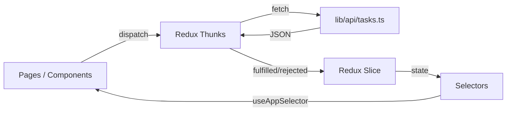
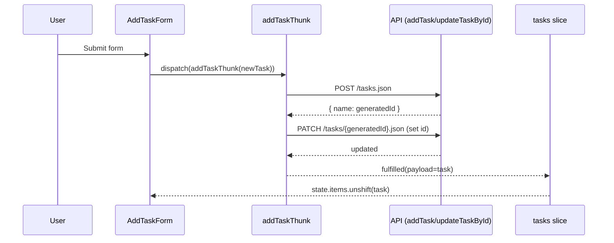

# Архітектура проєкту (To‑Do / Tasks Management App)

## 1) Призначення

Це невеликий навчальний застосунок “To‑Do” для керування задачами:
- перегляд списку задач;
- фільтрація за назвою та статусом;
- сортування за датою створення;
- додавання нової задачі;
- зміна статусу задачі;
- видалення задачі;
- простий “Dashboard” зі статистикою.

Основна ціль роботи — показати зрозумілу структуру коду та взаємодію модулів.

## 2) Стек технологій

- **Next.js 15** (App Router) — маршрутизація та сторінки (`src/app/*`)
- **React 19** — UI
- **TypeScript** — типізація (`src/types/*`)
- **Redux Toolkit + react-redux** — стан задач (`src/lib/store.ts`, `src/lib/tasks/*`)
- **TailwindCSS** — стилі (`src/app/globals.css`, `tailwind.config.ts`)
- **REST API через fetch** — робота з бекендом (`src/lib/api/tasks.ts`)
- **react-toastify** — сповіщення

## 3) Загальна ідея архітектури (шари)

Проєкт організований “простими шарами” (layered architecture) без надлишкової складності:

1. **UI / Pages (Presentation)**  
   Компоненти сторінок та layout’и отримують/показують дані, реагують на події користувача.

2. **State (Application State)**  
   Redux store, slice, thunks, selectors — централізований стан задач та бізнес‑логіка роботи зі станом.

3. **Data Access (API)**  
   Функції доступу до REST endpoint’ів через `fetch`. Логіка мережі ізольована від UI.

4. **Types (Domain Types)**  
   Окремі типи/enum для задач, фільтрів, статусів.

## 4) Структура каталогів

Ключова структура (скорочено):

```
src/
  app/                    # Next.js App Router (routes, layouts)
    layout.tsx            # Root layout: провайдери, стилі, ToastContainer
    page.tsx              # Головна сторінка (Hero)
    tasks/                # /tasks
      layout.tsx          # Layout з Sidebar
      page.tsx            # Список задач + фільтри + модалка додавання
    dashboard/            # /dashboard
      layout.tsx          # Layout з Sidebar
      page.tsx            # Статистика + “recent tasks”
    StoreProvider.tsx     # Redux Provider для клієнтських компонентів

  components/
    ui/                   # Прості UI‑примітиви (Button, Modal, Title)
    common/               # Фічеві компоненти (TasksList, Filters, Sidebar, ...)

  lib/
    api/tasks.ts          # REST API клієнт (get/add/update/delete)
    store.ts              # configureStore()
    hooks.ts              # typed hooks (useAppDispatch/useAppSelector)
    tasks/
      slice.ts            # tasks slice (items + status)
      thunks.ts           # async‑операції (createAsyncThunk)
      selectors.ts        # вибірки/деривації (фільтри, статистика)

  types/
    task/                 # ITask, ITaskState, ITaskBodyOptional
    status/               # TaskStatus enum
    filter/               # IFilter
```

## 5) Модулі та їх відповідальність

### 5.1 `src/app/*` — маршрути, сторінки, layout’и

- `src/app/layout.tsx` — глобальний layout: шрифти, стилі, `ToastContainer`, обгортання в `StoreProvider`.
- `src/app/StoreProvider.tsx` — створює Redux store (через `makeStore`) і підключає `react-redux` Provider.
- `src/app/tasks/page.tsx` — “екран задач”: локальні UI‑стани (фільтри, модалка) + читання задач із Redux.
- `src/app/dashboard/page.tsx` — “екран статистики”: рендер статистики та списку останніх задач.
- `src/app/tasks/layout.tsx` і `src/app/dashboard/layout.tsx` — спільний layout із `Sidebar`.

### 5.2 `src/components/*` — UI та фічеві компоненти

- `src/components/ui/*` — невеликі незалежні компоненти (кнопка, заголовок, модальне вікно).
- `src/components/common/*` — компоненти, що “знають” про задачі та Redux:
  - `AddTaskForm` — форма додавання, викликає `addTaskThunk`.
  - `TasksList` / `TaskListItem` — показ задач, зміна статусу/видалення (`updateTaskThunk`, `deleteTaskThunk`).
  - `Filters` — локальна логіка фільтрів (стан зберігається на сторінці `/tasks`).
  - `StatisticsList` — показ агрегованих значень зі selector’а `selectStatistics`.
  - `RecentTasksList` — завантажує задачі та показує останні 5.
  - `Sidebar` — навігація між розділами.

### 5.3 `src/lib/tasks/*` — стан задач (Redux Toolkit)

- `slice.ts` — єдиний “source of truth” для `tasks.items` і `tasks.status`.
- `thunks.ts` — async‑операції:
  - `getTasksThunk` — завантаження списку;
  - `addTaskThunk` — створення задачі;
  - `updateTaskThunk` — оновлення задачі (частково);
  - `deleteTaskThunk` — видалення задачі.
- `selectors.ts` — селектори:
  - `selectTasksWithFilters` — застосовує сортування/фільтрацію на клієнті;
  - `selectStatistics` — рахує задачі по статусах.

### 5.4 `src/lib/api/tasks.ts` — доступ до даних

Модуль із функціями, що роблять `fetch` запити до бекенду. Конфігурується через env:
- `NEXT_PUBLIC_BASE_URL`
- `NEXT_PUBLIC_API_KEY`

UI напряму не викликає API — лише через thunk’и.

### 5.5 `src/types/*` — доменні типи

Винесені типи спрощують читання коду та зменшують помилки:
- `ITask` — модель задачі;
- `TaskStatus` — можливі статуси;
- `IFilter` — структура фільтрів.

## 6) Потік даних (як модулі взаємодіють)

### 6.1 Загальна схема



### 6.2 Типовий сценарій: завантаження задач

1. `src/app/tasks/page.tsx` або `RecentTasksList` викликає `dispatch(getTasksThunk())`.
2. `getTasksThunk` звертається до `getTasks()` у `src/lib/api/tasks.ts`.
3. `slice.ts` отримує `fulfilled` і записує `items` у store.
4. UI читає state через selector (наприклад, `selectTasksWithFilters`) і рендерить список.

### 6.3 Типовий сценарій: додавання задачі



## 7) Де знаходиться “бізнес‑логіка”

- **Взаємодія з бекендом** — `src/lib/api/tasks.ts` + `src/lib/tasks/thunks.ts`
- **Оновлення/зберігання стану** — `src/lib/tasks/slice.ts`
- **Фільтри/сортування/статистика** — `src/lib/tasks/selectors.ts`
- **UI‑стан (модалка/значення фільтрів)** — локально в сторінці `src/app/tasks/page.tsx`

## 8) Запуск проєкту (для перевірки)

1. Встановити залежності: `npm install`
2. Створити `.env.local` і додати:
   - `NEXT_PUBLIC_BASE_URL=...`
   - `NEXT_PUBLIC_API_KEY=...`
3. Запустити: `npm run dev`

